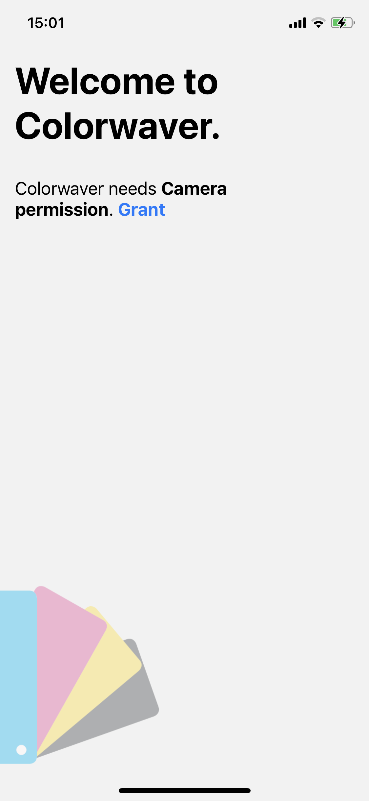

<div align="center">
  <h1>Colorwaver</h1>
</div>

An app to detect **colorwaves** (swatches/palettes) in the real world - powered by [VisionCamera](https://github.com/mrousavy/react-native-vision-camera)

<table>
  <tr>
    <td>
      
    </td>
    <td>
      
    </td>
  </tr>
</table>

## Try it!

Download the repository and run the following commands to try **Colorwaver** for yourself:

### iOS

```sh
yarn try-ios
```

### Android

```sh
yarn try-android
```

## Project structure

This is a bare React Native project, created with [create-react-native-app](https://github.com/expo/create-react-native-app).

---

### 📁 `android`

Contains the source code for the android app.

#### 📄 `android/app/build.gradle`

The gradle build file for the Android project. The following third-party dependencies are installed:

* `androidx.camera`: `camera-core`
* `androidx.palette`: `palette`

#### 📁 `android/app/src/main/java/com/colorwaver/utils`

Contains two files copied from [**android/camera-samples**](https://github.com/android/camera-samples/tree/master/Camera2Basic/utils/src/main/java/com/example/android/camera/utils) to convert `ImageProxy` instances to `Bitmap`s. (`YuvToRgbConverter.kt`)

#### 📁 `android/app/src/main/java/com/colorwaver`

Contains the actual Java source code of the Project.

##### 📄 `android/app/src/main/java/com/colorwaver/MainApplication.java`

Sets up react-native-reanimated.

##### 📄 `android/app/src/main/java/com/colorwaver/MainActivity.java`

Installs the `PaletteFrameProcessorPlugin` frame processor plugin inside of the `onCreate` method.

##### 📄 `android/app/src/main/java/com/colorwaver/PaletteFrameProcessorPlugin.java`

Contains the actual Java code for the native Android frame processor plugin "`getColorPalette(...)`".
This uses the `YuvToRgbConverter` to convert the `ImageProxy` to a `Bitmap`, and then passes that to the [Palette API from AndroidX](https://developer.android.com/reference/androidx/palette/graphics/Palette) to build the color palette.
VisionCamera's [frame processor API](https://mrousavy.github.io/react-native-vision-camera/docs/guides/frame-processors-plugins-overview) is used to expose this function as a frame processor plugin.

---

### 📁 `ios`

Contains the source code for the iOS app.

#### 📄 `ios/Podfile`

Adds the [`UIImageColors`](https://github.com/jathu/UIImageColors) library.

#### 📄 `ios/Colorwaver-Bridging-Header.h`

A Bridging Header to import Objective-C headers into Swift.

#### 📄 `ios/PaletteFrameProcessorPlugin.m`

Declares the Swift frame processor plugin "`getColorPalette(...)`".

#### 📄 `ios/PaletteFrameProcessorPlugin.swift`

Contains the actual Swift code for the native iOS frame processor plugin "`getColorPalette(...)`".
This uses the CoreImage API to convert the `CMSampleBuffer` to a `UIImage`, and then uses the [`UIImageColors`](https://github.com/jathu/UIImageColors) library to build the color palette.
VisionCamera's [frame processor API](https://mrousavy.github.io/react-native-vision-camera/docs/guides/frame-processors-plugins-overview) is used to expose this function as a frame processor plugin.

#### 📄 `ios/UIColor+hexString.swift`

An extension for `UIColor` to convert `UIColor` instances to strings. This is required because React Native handles colors as strings.

---

### 📁 `src`

Contains the actual TypeScript + React (-Native) front-end for the Colorwaver App.

#### 📄 `src/getColorPalette.ts`

Exposes the native iOS/Android frame processor plugin as a JS function with TypeScript types. This function has to be called from a frame processor. (`'worklet'`)

#### 📄 `src/Router.tsx`

The main component that gets registered by `index.js`. This acts as a main navigator, navigating either to the Splash Page (Permissions) or the App Page (Main App) depending on whether the user has granted permissions or not.

#### 📄 `src/Splash.tsx`

The first Splash page to ask the user for Camera permission.

#### 📄 `src/App.tsx`

Contains the actual source code for the App's front-end.

* [VisionCamera](https://github.com/mrousavy/react-native-vision-camera) is used to get a Camera device and **display a Camera component**. Also, a [frame processor](https://mrousavy.github.io/react-native-vision-camera/docs/guides/frame-processors) (a function that gets called for every frame the camera "sees") gets attached, which **calls the native iOS/Android frame processor plugin**.
* [Reanimated](https://github.com/software-mansion/react-native-reanimated) is used to smoothly animate between color changes.

Because VisionCamera also uses the Worklet API, the entire process between receiving a camera frame and actually displaying the palette's colors **does not use the React-JS Thread at all**. The frame processing runs on a separate Thread from VisionCamera, which then dispatches the animations on the Reanimated UI Thread.
This is why the App runs as smooth as a native iOS or Android app.

#### 📄 `src/useAnimatedColor.ts`

A helper function to animate color changes with `SharedValue`s.

---

### 📄 `babel.config.js`

Adds the native frame processor plugin `getColorPalette` (called `__getColorPalette`) to Reanimated's `global` list.
